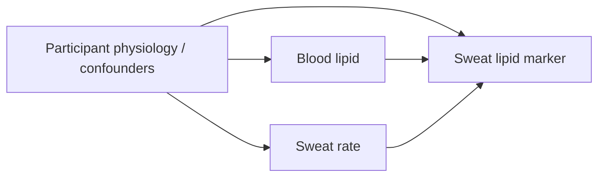

# Causal Model Used For Feature Selection

This public repository exposes the causal assumptions used to define the
Figure 5h-i model inputs. It is a minimal public release, not a full release of
restricted participant-level data.

## Assumed Graph

For both total cholesterol and triglycerides, the working graph is:



The public code writes the graph edges to
`results/causal_adjustment/causal_dag_edges.csv`.

## Adjustment Rationale

The causal question behind the feature selection is whether sweat lipid
measurements carry blood-lipid information after accounting for sweat secretion
and participant physiology.

The minimal prediction feature set used for the Figure 5h-i "Causal ML" row is task specific:

```text
CH: sweat cholesterol + sweat rate + BMI + sex
TG: sweat triglyceride + sweat rate + BMI
```

This corresponds to:

- the sweat lipid marker as the sensor-derived signal,
- sweat rate as a dynamic sweat-transport variable,
- BMI as the minimal public proxy for adiposity/metabolic participant
  physiology in the submitted Figure 5h-i model comparison,
- sex as an additional CH adjustment variable, matching the task-specific DAG
  described in the manuscript.

The broader candidate confounder set, when available in the restricted
participant-level dataset, includes age, gender, HbA1c/glucose, blood pressure,
pulse, weight, BMI, BMR, body-fat measures, fat-free mass, predicted muscle
mass, and total body water.

## What The Scripts Do

`src/causal_specification.py` exports the DAG edges, adjustment sets, and
prediction feature sets as CSV files.

`src/run_causal_adjustment.py` computes adjusted blood-to-sweat associations by
residualizing blood lipid and sweat lipid against each adjustment set, then
reporting the residual slope and partial correlation.

`src/reproduce_figure5hi.py` uses the same causal specification to define the
"Causal ML" model inputs and then evaluates the predictive estimator by 5-fold
cross-validation.
